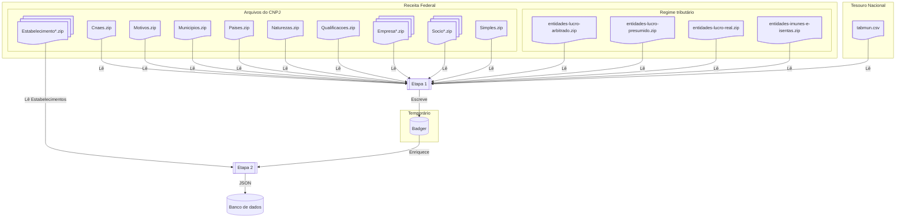

# <abbr title="Extract, Transform, Load">ETL</abbr>

Todos os dados manipulados por esse pacote vem da [Receita Federal](https://dados.gov.br/dados/conjuntos-dados/cadastro-nacional-da-pessoa-juridica-cnpj), salvo o [arquivo do Tesouro Nacional com os códigos dos municípios do IBGE](https://www.tesourotransparente.gov.br/ckan/dataset/lista-de-municipios-do-siafi/resource/eebb3bc6-9eea-4496-8bcf-304f33155282).

### Contexto

Um número de CNPJ tem 3 partes: base, ordem e dígitos verificadores. Isso é importante pois influencia a forma que a Receita Federal disponibiliza os dados, e a forma que o Minha Receita transforma os dados. Por exempo, para o número de CNPJ `19.131.243/0001-97`:

| Base | Ordem | Dígitos verificadores |
|---|---|---|
| `19.131.243` | `0001` | `97` |

Uma mesma pessoa jurídica tem sempre a mesma base, e só varia a ordem (nas filiais dessa mesma pessoa jurídica, por exemplo), e os dígitos verificadores.

### Dados

Os dados são disponibilizados mensalmente em arquivos comprimidos (`.zip`) que contêm os dados do CNPJ. O grosso dos dados está nos arquivos CSV de estabelecimentos que tem `Estabelecimentos*` como prefixo, e as linhas desses arquivos tem um número de CNPJ completo como chave.

Os arquivos de regime tributário (`entidades-*.zip`) são distribuídos separadamente.

#### Dados que tem a base do CNPJ (apenas 8 primeiros dígitos do número de CNPJ) como chave

Entre os arquivos do CNPJ:

* Arquivos com o prefixo `Empresas*` tem o básico dos dados, como razão social, natureza jurídica e porte.
* Arquivos com o prefixo `Socios*` tem informações sobre o quadro societário de cada pessoa jurídica.
* Arquivo `Simples.zip` tem informações sobre adesão das pessoas jurídicas ao Simples e MEI.

#### Dados que tem o CNPJ completo como chave

* Regime tributário (`entidades-lucro-arbitrado.zip`, `entidades-lucro-presumido.zip`, `entidades-lucro-real.zip` e `entidades-imunes-e-isentas.zip`)

#### Dados com outras chaves

Na leitura desses arquivos existem campos que contém um código numérico, mas sem descrição do significado (por exemplo, temos o código 9701 para o município de Brasília). Esses arquivos são chamados de tabelas de _look up_:

Entre os arquivos do CNPJ:

* Arquivo `Cnaes.zip` com descrição dos CNAEs
* Arquivo `Motivos.zip` com descrição dos motivos cadastrais
* Arquivo `Municipios.zip` com o nome dos municípios
* Arquivo `Paises.zip` com o nome dos países
* Arquivo `Naturezas.zip` com o nome da natureza jurídica
* Arquivo `Qualificacoes.zip` com a descrição da qualificação de cada pessoa do quadro societário

Mais o arquivo do Tesouro Nacional com os códigos dos municípios do IBGE (baixado atutomática e temporariamente durante a execução do ETL).

## Estratégia de carregamento dos dados

A etapa de transformação dos dados acontece em duas etapas. Primeiro, todos os dados relacionais são carregados em um armazenamento de chave e valor em disco. Em seguida, cada linha dos `Estabelecimentos*` é lida, enriquecida com esses pares de chave e valor, e então enviada para o banco de dados.

| Etapa | Descrição | Armazenamento |
|:-:|---|---
| 1 | Carrega pares de chave e valor para: `Cnaes.zip`, `Motivos.zip`, `Municipios.zip`, `Paises.zip`, `Naturezas.zip`, `Qualificacoes.zip`, `Empresas*`, `Socios*`, `Simples.zip`, regimes tributários (`entidades-*.zip`) e códigos dos municípios do IBGE | [Badger](https://dgraph.io/docs/badger/) |
| 2 | Lê os arquivos `Estabelecimentos*`, enriquece com os dados da etapa anterior e salva os resultados no banco de dados | Banco de dados |
